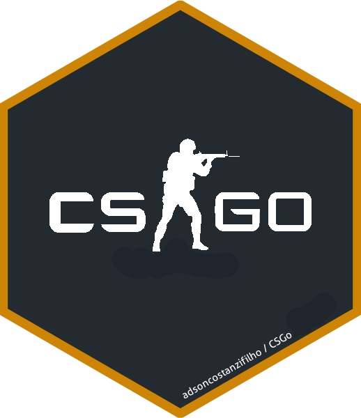

<!-- README.md is generated from README.Rmd. Please edit that file -->

# CSGo 

<br>

<!-- badges: start -->
<!-- badges: end -->

R client for accessing Steam’s REST API specifically for the
Counter-Strike Global Offensive Game (CS Go) data. Check out the [Steam
documentation
website](https://developer.valvesoftware.com/wiki/Steam_Web_API) for
more information.

## Package Functionality

The goal of `CSGo` is to provide an easy way to connect and pull data
from the Steam API specifically for the Counter-Strike Global Offensive
Game (CS Go).

## Responsible use

The `CSGo` package should be used in strict accordance with [Steam Api
Terms of Use](https://steamcommunity.com/dev/apiterms).

## Installation

The `CSGo` package still doesn’t have released on CRAN, but you can use
the development version from
[GitHub](https://github.com/adsoncostanzifilho/CSGo) with:

``` r
# install.packages("devtools")
devtools::install_github("adsoncostanzifilho/CSGo")
```

## Example

The first step to use the `CSGo` package is to have your own credentials
(API key) to pull the CSGo data from the Steam API.

For more information about how to get your own API Key run in your R
`vignette("auth", package = "CSGo")`.

Now that you already have your API Key you should be able to collect
your own CSGo data as well as your friends’ data.

``` r
library(CSGo)

# to get my own statistics
my_stats <- get_stats_user(api_key = 'your_key',user_key = '76561198263364899')

# to get my the statistics of all my "public" friends
friends_stats <- get_stats_friends(api_key = 'your_key',user_key = '76561198263364899')
```

*PS*: Don’t worry, the function `get_stats_friends` will only collect
the data of your friends with “Public” status.
