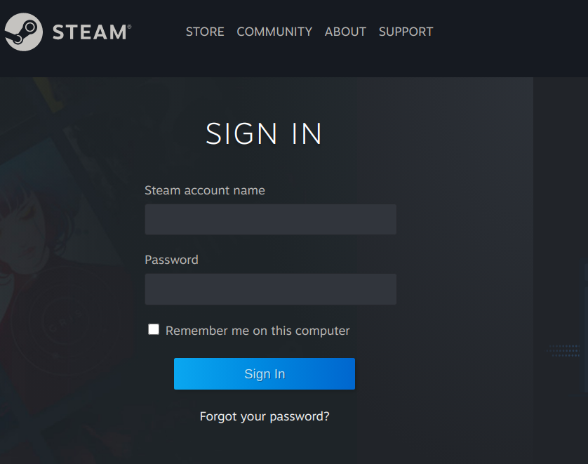

```{r, include = FALSE}
knitr::opts_chunk$set(
  collapse = TRUE,
  comment = "#>"
)
```

This vignette covers how to create your own Steam API key, to be able to use the `CSGo` package to pull data from the steam API.

## Creating a Steam Account

The very first step to get your own Steam API credentials is to have an **Steam Account**. To do that you need to access [this link](https://store.steampowered.com/join), and fill the requested information.

**PS**: Keep in mind that you will need to agree with the [Steam Api Terms of Use](https://steamcommunity.com/dev/apiterms), and that you should have **spend more than 5.00 USD in the Steam Store** to be able to get the API key.

## API Key Request

Now that you are a Steam member, and already spend more than 5.00 USD in the store you should be able to request your own Steam API Key. Enter [here](https://steamcommunity.com/login/home/?goto=%2Fdev%2Fapikey ) and sign in with your Steam Account Name and Password.

<p align="center"></p>

In the next screen you should fill your Steam Domain Name, confirm the  [Steam Api Terms of Use](https://steamcommunity.com/dev/apiterms) check box and click on the "Register" button.

<p align="center"></p>

If everything went well you should see an screen as bellow with your own **Steam Web API Key**.

<p align="center"></p>

## Key Test

Now that you already have your Steam API Key you should be able to use any function in the `CSGo` package.

Try to run it filling your own API key:
```{r example1, eval=FALSE}
library(CSGo)

df <- csgo_api_profile(api_key = 'your_key', user_id = '76561198263364899')

```

## Finding the Users

The second mandatory argument is the `user_id` which represents the **Steam ID**. The Steam ID is the **number OR name** at the end the steam profile URL.

### Example

If the Steam Profile URL is https://steamcommunity.com/profiles/76561198263364899/ the user_id is **76561198263364899**.

If the Steam Profile URL is https://steamcommunity.com/id/generalcapivara/ the user_id is **generalcapivara**.

**IMPORTANT**: The steam profile should have the *"Public"* status for you be able to get specific information like Achievements and Statistics.

```{r example2, eval=FALSE}
library(CSGo)

df1 <- csgo_api_profile(api_key = 'your_key', user_id = '76561198263364899')
df2 <- csgo_api_profile(api_key = 'your_key', user_id = 'generalcapivara', name = TRUE)

```

That's it!!!


