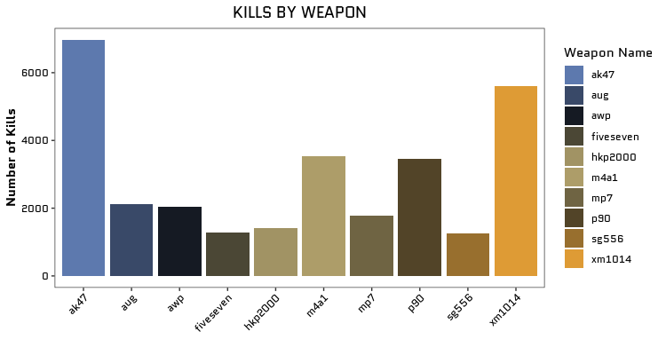
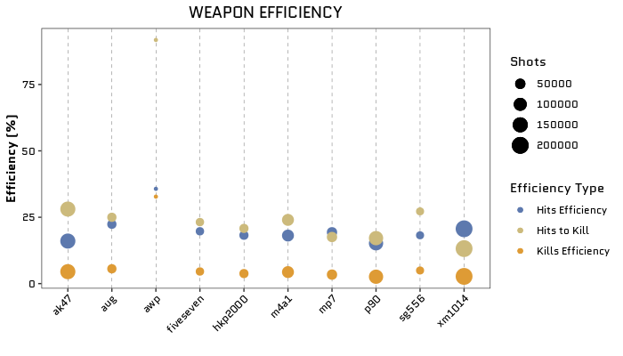

```{r, include = FALSE}
knitr::opts_chunk$set(
  collapse = TRUE,
  comment = "#>"
)
```

This vignette covers how to use some functions from the `CSGo` package in a use case format.

## Data Extraction and Analysis

The first step to use the `CSGo` package is to have your own credentials (API key) to pull the CSGo data from the Steam API. For more information about how to get your own API Key run in your R `vignette("auth", package = "CSGo")`.

Now that you already have your *API Key* you should be able to collect your own CSGo data as well as your friends' data. I hope my friend [Rodrigo](https://github.com/Rodrigo-Fontoura) doesn't mind us playing with his data (he is the '76561198263364899')!

First let's pull his CSGo statistics:

```{r eval = FALSE}
library(CSGo)

# to get the statistics of the user 76561198263364899
rodrigo_stats <- get_stats_user(api_key = 'your_key', user_id = '76561198263364899')

```

Let's just filter the obtained data frame by "kills" and "weapon" to create an analysis of kills by type of weapon.

```{r eval = FALSE}
library(dplyr)
library(stringr)

rodrigo_weapon_kill <- rodrigo_stats %>%
  filter(
    str_detect(name, 'kill'),
    type == ' weapon info'
  ) %>%
  arrange(desc(value))

```

Now let's take a look at the graphic!

*PS*: To make the graphic even more beautiful I recommend getting the "Quantico" font from Google fonts using the `showtext` package! 

```{r eval = FALSE}
library(ggplot2)
library(showtext)

## Loading Google fonts (https://fonts.google.com/)
font_add_google("Quantico", "quantico")

rodrigo_weapon_kill %>%
  top_n(n = 10, wt = value) %>%
  ggplot(aes(x = name_match, y = value, fill = name_match)) +
  geom_col() +
  ggtitle("KILLS BY WEAPON") +
  ylab("Number of Kills") +
  xlab("") +
  labs(fill = "Weapon Name") +
  theme_csgo(text = element_text(family = "quantico")) +
  scale_fill_csgo()

```

<p align="center"></p>

So, these are the top 10 weapons by kills, but.. What about the efficiency? Is the **ak47** the Rodrigo's more efficient weapon? First, let's define "efficiency":

* **kills_efficiency** means how many shots he did to kill (ex: 32% shots will kill) 

* **hits_efficiency** means how many shots to have a hit, this is more related to Rodrigo's ability with each weapon (ex: 35% of the shots will hit).

* **hits_to_kill** means how many hits are necessary to kill, this is more related to the weapon power/efficiency (ex: 91% of the hits will kills).

```{r eval = TRUE, message = FALSE, echo = FALSE}
library(knitr)
rodrigo_efficiency <- readRDS('data/rodrigo_efficiency.RDS')
```

```{r eval = FALSE, message = FALSE, results='asis'}

rodrigo_efficiency <- rodrigo_stats %>%
  filter(
    name_match %in% c("ak47", "aug", "awp", "fiveseven",
                      "hkp2000", "m4a1", "mp7", "p90",
                      "sg556", "xm1014")
  ) %>%
  mutate(
    stat_type = case_when(
      str_detect(name, "shots") ~ "shots",
      str_detect(name, "hits") ~ "hits",
      str_detect(name, "kills") ~ "kills"
    )
  ) %>% 
  pivot_wider(
    names_from = stat_type, 
    id_cols = name_match, 
    values_from = value
  ) %>%
  mutate(
    kills_efficiency = kills/shots*100,
    hits_efficiency = hits/shots*100,
    hits_to_kill = kills/hits*100
  )

kbl(rodrigo_efficiency) %>%
  kable_styling()
```

```{r eval = TRUE, message = FALSE, echo = FALSE}
knitr::kable(rodrigo_efficiency)
```

```{r eval = FALSE}
rodrigo_efficiency %>%
  top_n(n = 10, wt = kills) %>%
  ggplot(aes(x = name_match, size = shots)) +
  geom_point(aes(y = kills_efficiency, color = "Kills Efficiency")) +
  geom_point(aes(y = hits_efficiency, color = "Hits Efficiency")) +
  geom_point(aes(y = hits_to_kill, color = "Hits to Kill")) +
  ggtitle("WEAPON EFFICIENCY") +
  ylab("Efficiency (%)") +
  xlab("") +
  labs(color = "Efficiency Type", size = "Shots") +
  theme_csgo(
    text = element_text(family = "quantico"),
    panel.grid.major.x = element_line(size = .1, color = "black",linetype = 2)
  ) +
  scale_color_csgo()

```

<p align="center"></p>

In conclusion, I would advise Rodrigo to use the **awp** in his next games, because this weapon presented the best efficiency in terms of **shots to kill**, **shots to hit**, and **hits to kill**. But we definitely need more shots with this weapon to see if this efficiency remains.. hahahaha
